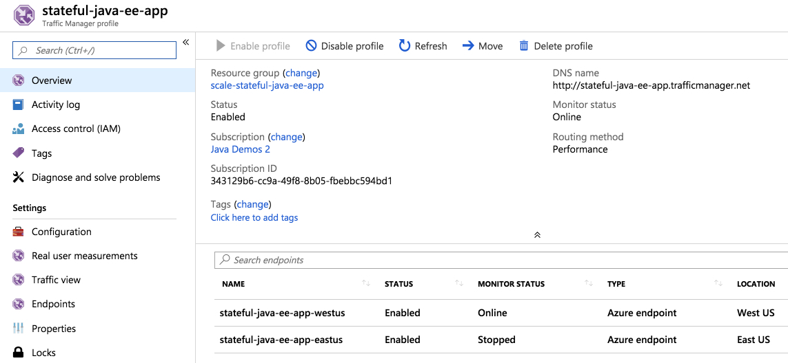

# Scaling Stateful Java Apps on Azure

This guide walks you through the process of scaling 
stateful Java EE on Azure, aka:
 
- Migrate or deploy stateful Java EE to App Service Linux
- Externalize HTTP sessions to Azure SQL Database 

## Table of Contents

   * [Scaling Stateful Java Apps on Azure](#scaling-stateful-java-apps-on-azure)
      * [Table of Contents](#table-of-contents)
      * [What you will migrate to cloud](#what-you-will-migrate-to-cloud)
      * [What you will need](#what-you-will-need)
      * [Getting Started](#getting-started)
         * [Step ONE - Clone and Prep](#step-one---clone-and-prep)
      * [Build Scalable Layout for Stateful Java EE Apps on Azure](#build-scalable-layout-for-stateful-java-ee-apps-on-azure)
         * [Build the Stateful Java EE App:](#build-the-stateful-java-ee-app)
         * [Deploy the Stateful Java EE App to First Data Center:](#deploy-the-stateful-java-ee-app-to-first-data-center)
         * [Deploy the Stateful Java EE App to Second Data Center:](#deploy-the-stateful-java-ee-app-to-second-data-center)
         * [Cluster Stateful Java EE Apps Behind Traffic Manager:](#cluster-stateful-java-ee-apps-behind-traffic-manager)
      * [Scale Stateful Java Apps on Azure](#scale-stateful-java-apps-on-azure)
         * [Application Composability - Multiple Apps of Service](#application-composability---multiple-apps-of-service)
         * [Application Elasticity](#application-elasticity)
         * [Failover Across Data Centers](#failover-across-data-centers)
         * [Reduced Memory Footprint](#reduced-memory-footprint)
         * [Flexibility of External Data Store](#flexibility-of-external-data-store)
         * [Externalize Sessions to Azure SQL Database](#externalize-sessions-to-azure-sql-database)
            * [Create SQL Database](#create-sql-database)
            * [Create Session State Table in SQL Database](#create-session-state-table-in-sql-database)
            * [Configure SQL Database Data Source](#configure-sql-database-data-source)
               * [Step 1: Understand How to configure WildFly](#step-1-understand-how-to-configure-wildfly)
               * [Step 2: Upload data source artifacts to App Service linux](#step-2-upload-data-source-artifacts-to-app-service-linux)
               * [Step 3: Set SQL Database connection info in the Web app environment](#step-3-set-sql-database-connection-info-in-the-web-app-environment)
               * [Step 4: Test the JBoss/WildFly CLI commands to configure data source](#step-4-test-the-jbosswildfly-cli-commands-to-configure-data-source)
               * [Step 5: Restart the remote WildFly app server](#step-5-restart-the-remote-wildfly-app-server)
               * [Step 6: Apply SAME changes to the second Java EE app and restart](#step-6-apply-same-changes-to-the-second-java-ee-app-and-restart)
            * [Disable Session Affinity Cookie (ARR cookie) for App Service Linux](#disable-session-affinity-cookie-arr-cookie-for-app-service-linux)
            * [Open Scaled Stateful Java EE Apps on Azure](#open-scaled-stateful-java-ee-apps-on-azure)
      * [Congratulations!](#congratulations)
      * [Resources](#resources)
      * [Contributing](#contributing)

## What you will migrate to cloud

You will migrate stateful Java EE app to Azure, scale it 
across geographies
and demo failover across data centers. These
 apps use:

- Java Servlet (JSR 369)
- Java EE 7

Upon migration, you will power the apps using App Service Linux and
Azure SQL Database.

Migrated Java apps can be hosted anywhere – [virtual machines](https://docs.microsoft.com/en-us/azure/virtual-machines/linux/), 
[containers - AKS](https://docs.microsoft.com/en-us/azure/aks/intro-kubernetes) or 
[managed Tomcat or WildFly/JBoss in App Service Linux](https://docs.microsoft.com/en-us/azure/app-service/containers/quickstart-java). 
We chose the managed option. 
The underlying technique for migration is the SAME 
regardless of a choice of where migrated apps are hosted.

## What you will need

In order to deploy a Java Web app to cloud, you need 
an Azure subscription. If you do not already have an Azure 
subscription, you can activate your 
[MSDN subscriber benefits](https://azure.microsoft.com/pricing/member-offers/msdn-benefits-details/) 
or sign up for a 
[free Azure account]((https://azure.microsoft.com/pricing/free-trial/)).

In addition, you will need the following:

| [Azure CLI](http://docs.microsoft.com/cli/azure/overview) 
| [Java 8](https://www.azul.com/downloads/azure-only/zulu/) 
| [Maven 3](http://maven.apache.org/) 
| [Git](https://github.com/)
|

## Getting Started

You can start from scratch and complete each step, or 
you can bypass basic setup steps that you are already 
familiar with. Either way, you will end up with working code.

### Step ONE - Clone and Prep

```bash
git clone --recurse-submodules https://github.com/Azure-Samples/scaling-stateful-java-ee-app-on-azure
cd scaling-stateful-java-ee-app-on-azure
yes | cp -rf .prep/* .
```

## Build Scalable Layout for Stateful Java EE Apps on Azure

#### Build the Stateful Java EE App:

```bash

# change to initial directory
cd initial/stateful-java-web-app

# build WAR package
mvn package

[INFO] Scanning for projects...
[INFO] 
[INFO] ------------------------------------------------------------------------
[INFO] Building Stateful-Tracker 1.0.0-SNAPSHOT
[INFO] ------------------------------------------------------------------------
[INFO] 
[INFO] --- maven-resources-plugin:2.6:resources (default-resources) @ Stateful-Tracker ---
[INFO] Using 'UTF-8' encoding to copy filtered resources.
[INFO] Copying 1 resource
[INFO] 
[INFO] --- maven-compiler-plugin:3.8.0:compile (default-compile) @ Stateful-Tracker ---
[INFO] Changes detected - recompiling the module!
[INFO] Compiling 2 source files to /Users/selvasingh/GitHub/selvasingh/scaling-stateful-java-ee-app-on-azure/initial/stateful-java-web-app/target/classes
[INFO] 
[INFO] --- maven-resources-plugin:2.6:testResources (default-testResources) @ Stateful-Tracker ---
[INFO] Using 'UTF-8' encoding to copy filtered resources.
[INFO] skip non existing resourceDirectory /Users/selvasingh/GitHub/selvasingh/scaling-stateful-java-ee-app-on-azure/initial/stateful-java-web-app/src/test/resources
[INFO] 
[INFO] --- maven-compiler-plugin:3.8.0:testCompile (default-testCompile) @ Stateful-Tracker ---
[INFO] No sources to compile
[INFO] 
[INFO] --- maven-surefire-plugin:2.12.4:test (default-test) @ Stateful-Tracker ---
[INFO] No tests to run.
[INFO] 
[INFO] --- maven-war-plugin:3.2.2:war (default-war) @ Stateful-Tracker ---
[INFO] Packaging webapp
[INFO] Assembling webapp [Stateful-Tracker] in [/Users/selvasingh/GitHub/selvasingh/scaling-stateful-java-ee-app-on-azure/initial/stateful-java-web-app/target/Stateful-Tracker-1.0.0-SNAPSHOT]
[INFO] Processing war project
[INFO] Copying webapp resources [/Users/selvasingh/GitHub/selvasingh/scaling-stateful-java-ee-app-on-azure/initial/stateful-java-web-app/src/main/webapp]
[INFO] Webapp assembled in [220 msecs]
[INFO] Building war: /Users/selvasingh/GitHub/selvasingh/scaling-stateful-java-ee-app-on-azure/initial/stateful-java-web-app/target/Stateful-Tracker-1.0.0-SNAPSHOT.war
[INFO] ------------------------------------------------------------------------
[INFO] BUILD SUCCESS
[INFO] ------------------------------------------------------------------------
[INFO] Total time: 2.598 s
[INFO] Finished at: 2019-06-02T10:34:52-07:00
[INFO] Final Memory: 18M/213M
[INFO] ------------------------------------------------------------------------

```

#### Deploy the Stateful Java EE App to First Data Center:

Log into Azure using CLI

```bash
az login
```
Set environment variables for binding secrets at runtime, 
particularly: 
- Subscription ID
- Azure Resource Group name 
- Web App Name
- SQL Database Info (OPTIONAL - you may skip for now)
- Traffic Manager info
 
You can 
export them to your local environment, say using the supplied
Bash shell script template.

```bash
cp set-env-variables-template.sh .scripts/set-env-variables.sh
```

Modify `.scripts/set-env-variables.sh` and set Subscription,
Resource Group, Web App, Redis and Traffic Manager info. 
Then, set environment variables:
 
```bash
source .scripts/set-env-variables.sh
```

Deploy to WildFly/JBoss on App Service Linux. Add 
[Maven Plugin for Azure App Service](https://github.com/Microsoft/azure-maven-plugins/blob/develop/azure-webapp-maven-plugin/README.md) 
configuration to POM.xml and deploy stateful Java Web app to 
WildFly/JBoss in App Service Linux:

```xml
<plugin>
    <groupId>com.microsoft.azure</groupId>
    <artifactId>azure-webapp-maven-plugin</artifactId>
    <version>1.6.0</version>
    <configuration>

        <!-- Web App information -->
        <resourceGroup>${RESOURCEGROUP_NAME}</resourceGroup>
        <appServicePlanName>${WEBAPP_PLAN_NAME}-${REGION}</appServicePlanName>
        <appName>${WEBAPP_NAME}-${REGION}</appName>
        <region>${REGION}</region>

        <!-- Java Runtime Stack for Web App on Linux -->
        <linuxRuntime>wildfly 14-jre8</linuxRuntime>

        <appSettings>

            <property>
                <name>JAVA_OPTS</name>
                <value>-Xms2048m -Xmx2048m</value>
            </property>

        </appSettings>

    </configuration>
</plugin>
```

Deploy to WildFly/JBoss in App Service Linux, first data center:

```bash
mvn azure-webapp:deploy -DREGION=${REGION_1}

[INFO] Scanning for projects...
[INFO] 
[INFO] ------------------------------------------------------------------------
[INFO] Building Stateful-Tracker 1.0.0-SNAPSHOT
[INFO] ------------------------------------------------------------------------
[INFO] 
[INFO] --- azure-webapp-maven-plugin:1.6.0:deploy (default-cli) @ Stateful-Tracker ---
[INFO] Authenticate with Azure CLI 2.0
[INFO] Target Web App doesn't exist. Creating a new one...
[INFO] Creating App Service Plan 'stateful-java-ee-app-appservice-plan-westus'...
[INFO] Successfully created App Service Plan.
[INFO] Successfully created Web App.
[INFO] Trying to deploy artifact to stateful-java-ee-app-westus...
[INFO] Deploying the war file...
[INFO] Successfully deployed the artifact to https://stateful-java-ee-app-westus.azurewebsites.net
[INFO] ------------------------------------------------------------------------
[INFO] BUILD SUCCESS
[INFO] ------------------------------------------------------------------------
[INFO] Total time: 02:46 min
[INFO] Finished at: 2019-06-02T10:57:47-07:00
[INFO] Final Memory: 60M/615M
[INFO] ------------------------------------------------------------------------
```

#### Deploy the Stateful Java EE App to Second Data Center:

Deploy to WildFly/JBoss in App Service Linux, first data center:

```bash
mvn azure-webapp:deploy -DREGION=${REGION_2}

[INFO] Scanning for projects...
[INFO] 
[INFO] ------------------------------------------------------------------------
[INFO] Building Stateful-Tracker 1.0.0-SNAPSHOT
[INFO] ------------------------------------------------------------------------
[INFO] 
[INFO] --- azure-webapp-maven-plugin:1.6.0:deploy (default-cli) @ Stateful-Tracker ---
[INFO] Authenticate with Azure CLI 2.0
[INFO] Target Web App doesn't exist. Creating a new one...
[INFO] Creating App Service Plan 'stateful-java-ee-app-appservice-plan-eastus'...
[INFO] Successfully created App Service Plan.
[INFO] Successfully created Web App.
[INFO] Trying to deploy artifact to stateful-java-ee-app-eastus...
[INFO] Deploying the war file...
[INFO] Successfully deployed the artifact to https://stateful-java-ee-app-eastus.azurewebsites.net
[INFO] ------------------------------------------------------------------------
[INFO] BUILD SUCCESS
[INFO] ------------------------------------------------------------------------
[INFO] Total time: 02:11 min
[INFO] Finished at: 2019-06-02T11:01:00-07:00
[INFO] Final Memory: 59M/613M
[INFO] ------------------------------------------------------------------------
```

#### Cluster Stateful Java EE Apps Behind Traffic Manager:

Create Traffic Manager and cluster these stateful Java EE apps behind
the Traffic Manager.

```bash

# create traffic manager profile
az network traffic-manager profile create \
    --resource-group ${RESOURCEGROUP_NAME} \
    --name ${TRAFFIC_MANAGER_PROFILE_NAME} \
    --routing-method Performance \
    --unique-dns-name ${TRAFFIC_MANAGER_DNS_NAME} \
    --ttl 10 --protocol HTTP --port 80 --path "/"

# create first endpoint
az network traffic-manager endpoint create \
    --resource-group ${RESOURCEGROUP_NAME} \
    --profile-name ${TRAFFIC_MANAGER_PROFILE_NAME} \
    --name ${WEBAPP_NAME}-${REGION_1} \
    --type azureEndpoints \
    --target-resource-id ${TARGET_RESOURCE_ID_1} \
    --endpoint-status enabled

# create second endpoint
az network traffic-manager endpoint create \
    --resource-group ${RESOURCEGROUP_NAME} \
    --profile-name ${TRAFFIC_MANAGER_PROFILE_NAME} \
    --name ${WEBAPP_NAME}-${REGION_2} \
    --type azureEndpoints \
    --target-resource-id ${TARGET_RESOURCE_ID_2} \
    --endpoint-status enabled
```

Traffic manager profile should look like this:


```bash
# open the traffic manager
open http://stateful-java-ee-app.trafficmanager.net
```


Let's stop one of the stateful Java EE app and check how 
failover happens:

```bash
az webapp stop -g ${RESOURCEGROUP_NAME} -n ${WEBAPP_NAME}-${REGION_1}
```

Failover failed because the session tracking begins from scratch,
particularly, once the connection breaks, the client 
is round robined to another server in East US data center,
then the correlation is lost.


Restart the stopped server:

```bash
az webapp start -g ${RESOURCEGROUP_NAME} -n ${WEBAPP_NAME}-${REGION_1}
```

## Scale Stateful Java Apps on Azure

External data stores, such as SQL Database, Redis Cache, Mongo DB or MySQL, 
can be used as an external cache for containers, such as Spring Boot, 
Tomcat and WildFly/JBoss. This allows external data store to store 
HTTP Sessions, among other data, independent of the application layer, 
which provides multiple benefits:

#### Application Composability - Multiple Apps of Service

By externalizing sessions and using multiple apps that form a service and 
bouncing users across these apps, you
can realize scenarios such as shopping cart state 
traveling with users as they navigate experiences
through multiple apps.

#### Application Elasticity

By making the application stateless additional Web apps may be added to 
the service cluster without expensive data rebalancing operations. The 
service cluster may also be replaced without downtime by keeping the 
state in the external data store, as upgraded Web apps may be brought 
online and retrieve the sessions.

#### Failover Across Data Centers

Should a data center become unavailable the session data persists, 
as it is stored safely within the external data store. This allows a 
load balancer to redirect incoming requests to a second cluster to 
retrieve the session information.

#### Reduced Memory Footprint

There is reduced memory pressure, resulting in shorter garbage 
collection time and frequency of collections, as the HTTP Sessions 
have been moved out of the application layer and into the backing caches.

#### Flexibility of External Data Store

External data store such as Azure SQL Database is available in 
[multiple purchase models](https://docs.microsoft.com/en-us/azure/sql-database/sql-database-purchase-models). 
“Azure SQL Database lets you easily purchase a fully managed platform as a service (PaaS) 
database engine that fits your performance and cost needs.”

### Externalize Sessions to Azure SQL Database

#### Create SQL Database

```bash

# Create Azure SQL Database
az sql up --resource-group ${RESOURCEGROUP_NAME} \
 --server-name ${SQL_SERVER_NAME} \
 --database-name ${SQL_DATABASE_NAME} --admin-user ${SQL_SERVER_ADMIN_LOGIN_NAME} \
 --admin-password ${SQL_SERVER_ADMIN_PASSWORD} \
 --location ${REGION}


Creating SQL Server 'external-store' in group 'scale-stateful-java-ee-app'...
Configuring server firewall rule, 'azure-access', to accept connections from all Azure resources...
Creating SQL database 'sessionstate'...
Checking your ip address...
Configuring server firewall rule, 'devbox', to allow for your ip address: 167.220.63.90
If SQL server declines your IP address, please create a new firewall rule using:
    `az sql server firewall-rule create -g scale-stateful-java-ee-app -s external-store -n {rule_name} --start-ip-address {ip_address} --end-ip-address {ip_address}`
Successfully Connected to SQL Database.
Ran Database Query: `CREATE USER root WITH PASSWORD = "======= MASKED ======="
Ran Database Query: `GRANT ALL TO root`
...
...
  
```

#### Create Session State Table in SQL Database

```bash
sqlcmd -S ${SQL_SERVER_FULL_NAME} \
    -d ${SQL_DATABASE_NAME} \
    -U ${SQL_SERVER_ADMIN_FULL_NAME} \
    -P ${SQL_SERVER_ADMIN_PASSWORD} \
    -Q \
        "
        IF OBJECT_ID('[dbo].[ispn_entry_ROOT_war]') IS NOT NULL
            DROP TABLE [dbo].[ispn_entry_ROOT_war]
        GO

        SET ANSI_NULLS ON
        GO

        SET QUOTED_IDENTIFIER ON
        GO

        CREATE TABLE [dbo].[ispn_entry_ROOT_war](
        [id] [varchar](900) NOT NULL,
        [datum] [binary](1000) NOT NULL,
        [version] [bigint] NOT NULL,
        PRIMARY KEY CLUSTERED
        (
        [id] ASC
        )WITH (STATISTICS_NORECOMPUTE = OFF, IGNORE_DUP_KEY = OFF) ON [PRIMARY]
        ) ON [PRIMARY]
        GO"
```

#### Configure SQL Database Data Source

There are 5 steps to configure a data source. These steps are similar to configuring data sources 
in any on premise Java EE app servers:

##### Step 1: Understand How to configure WildFly

In App Service, each instance of an app server is stateless. Therefore, each instance must be 
configured on startup to support a Wildfly configuration needed by your application. You can configure at 
startup by supplying a startup Bash script that calls [JBoss/WildFly CLI commands](https://docs.jboss.org/author/display/WFLY/Command+Line+Interface) to setup data sources, messaging 
 providers and any other dependencies. We will create a startup.sh script and place it in the `/home` 
 directory of the Web app. The script will:
 
Install a WildFly module:

```bash
# where resources point to JDBC driver for SQL Database
# and module xml points to module description, see below

module add --name=com.microsoft --resources=/home/site/deployments/tools/mssql-jdbc-7.2.1.jre8.jar --module-xml=/home/site/deployments/tools/mssql-module.xml

```
Where `mssql-module.xml` describes the module:

```xml
<?xml version="1.0" ?>
<module xmlns="urn:jboss:module:1.1" name="com.microsoft">
  <resources>
	<resource-root path="/home/site/deployments/tools/mssql-jdbc-7.2.1.jre8.jar"/>
  </resources>
  <dependencies>
    <module name="javax.api"/>
    <module name="javax.transaction.api"/>
  </dependencies>
</module>
```
 
Add a JDBC driver for SQL Database:

```bash
/subsystem=datasources/jdbc-driver=sqlserver:add(driver-name="sqlserver",driver-module-name="com.microsoft",driver-class-name=com.microsoft.sqlserver.jdbc.SQLServerDriver)
```

Install a data source by using the data-source shortcut command:

```bash
data-source add --name=sqlDS --jndi-name=java:/sqlDS --connection-url=${SQL_CONNECTION_URL,env.SQL_CONNECTION_URL:jdbc:sqlserver://sqlserverhost:1433;DatabaseName=db} --driver-name=sqlserver --validate-on-match=true --background-validation=false --valid-connection-checker-class-name=org.jboss.jca.adapters.jdbc.extensions.mssql.MSSQLValidConnectionChecker --exception-sorter-class-name=org.jboss.jca.adapters.jdbc.extensions.mssql.MSSQLExceptionSorter
```

Configure Web local cache to use the above SQL Database

```bash
/subsystem=infinispan/cache-container=web/local-cache=passivation/store=jdbc:add(data-source="sqlDS",passivation=false,preload=true,shared)
```

A server reload may be required for the changes to take effect:

```bash
reload --use-current-server-config=true
```

These JBoss CLI commands, JDBC driver for SQL Database and module XML are available in 
[initial/stateful-java-web-app/.scripts](https://github.com/azure-samples/scaling-stateful-java-ee-app-on-azure/tree/master/initial/stateful-java-web-app/.scripts) 

Also, you can directly download [JDBC driver for SQL Database](https://docs.microsoft.com/en-us/sql/connect/jdbc/download-microsoft-jdbc-driver-for-sql-server). For example:


##### Step 2: Upload data source artifacts to App Service linux

Use Azure CLI to get FTP deployment credentials:

```bash
az webapp deployment list-publishing-profiles -g ${RESOURCEGROUP_NAME} -n ${WEBAPP_NAME}-${REGION_1}

[
  
    "profileName": "stateful-java-ee-app-westus - FTP",
    "publishMethod": "FTP",
    "publishUrl": "ftp://waws-prod-bay-063.ftp.azurewebsites.windows.net/site/wwwroot",
    "userName": "stateful-java-ee-app-westus\\$stateful-java-ee-app-westus",
    "userPWD": "======= MASKED ======="",
    "webSystem": "WebSites"
  }
]
```
Store FTP deployment credentials in `.scripts/set-env-variables.sh`.

Open an FTP connection to App Service Linux to upload data source artifacts:

```bash

cd .scripts

ftp 
ftp> open waws-prod-bay-063.drip.azurewebsites.windows.net
Trying 23.99.84.148...
Connected to waws-prod-bay-063.drip.azurewebsites.windows.net.
220 Microsoft FTP Service
Name (waws-prod-bay-063.drip.azurewebsites.windows.net:selvasingh): stateful-java-ee-app-westus\\$stateful-java-ee-app-westus
331 Password required
Password: 
230 User logged in.
Remote system type is Windows_NT.
ftp> ascii
200 Type set to A.
ftp> put startup.sh
local: startup.sh remote: startup.sh
229 Entering Extended Passive Mode (|||10136|)
125 Data connection already open; Transfer starting.
100% |*******************************************************|   125       20.57 KiB/s    --:-- ETA
226 Transfer complete.
125 bytes sent in 00:00 (4.08 KiB/s)
ftp> cd site/deployments/tools
250 CWD command successful.
ftp> put mssql-datasource-commands.cli
local: mssql-datasource-commands.cli remote: mssql-datasource-commands.cli
229 Entering Extended Passive Mode (|||10137|)
125 Data connection already open; Transfer starting.
100% |*******************************************************|  1261      209.71 KiB/s    --:-- ETA
226 Transfer complete.
1261 bytes sent in 00:00 (34.90 KiB/s)
ftp> put mssql-module.xml
local: mssql-module.xml remote: mssql-module.xml
229 Entering Extended Passive Mode (|||10141|)
125 Data connection already open; Transfer starting.
100% |*******************************************************|   321       54.07 KiB/s    --:-- ETA
226 Transfer complete.
321 bytes sent in 00:00 (10.20 KiB/s)
ftp> binary
200 Type set to I.
ftp> put mssql-jdbc-7.2.1.jre8.jar
local: mssql-jdbc-7.2.1.jre8.jar remote: mssql-jdbc-7.2.1.jre8.jar
229 Entering Extended Passive Mode (|||10138|)
125 Data connection already open; Transfer starting.
100% |*******************************************************|  1135 KiB  979.01 KiB/s    00:00 ETA
226 Transfer complete.
1162710 bytes sent in 00:01 (952.14 KiB/s)
ftp> bye
221 Goodbye.
```

##### Step 3: Set SQL Database connection info in the Web app environment

Use Azure CLI to set database connection info:
   
```bash

az webapp config appsettings set  \
    --resource-group ${RESOURCEGROUP_NAME} \
    --name ${WEBAPP_NAME}-${REGION_1}  \
    --settings  SQL_CONNECTION_URL=${SQL_CONNECTION_URL} \
    SQL_SERVER_ADMIN_FULL_NAME=${SQL_SERVER_ADMIN_FULL_NAME} \
    SQL_SERVER_ADMIN_PASSWORD=${SQL_SERVER_ADMIN_PASSWORD}

[
  {
    "name": "JAVA_OPTS",
    "slotSetting": false,
    "value": "-Xms2048m -Xmx2048m"
  },
  {
    "name": "SQL_CONNECTION_URL",
    "slotSetting": false,
    "value": "======= MASKED ======="
  }
]
```

##### Step 4: Test the JBoss/WildFly CLI commands to configure data source

You can test Bash script for configuring data source by running them on App Service Linux 
by [opening an SSH connection from your development machine](https://docs.microsoft.com/en-us/azure/app-service/containers/app-service-linux-ssh-support#open-ssh-session-from-remote-shell):

```bash

az webapp ssh --resource-group ${RESOURCEGROUP_NAME} --name ${WEBAPP_NAME}-${REGION_1}
  _____                               
  /  _  \ __________ _________   ____  
 /  /_\  \___   /  |  \_  __ \_/ __ \ 
/    |    \/    /|  |  /|  | \/\  ___/ 
\____|__  /_____ \____/ |__|    \___  >
        \/      \/                  \/ 
A P P   S E R V I C E   O N   L I N U X

Documentation: http://aka.ms/webapp-linux

**NOTE**: No files or system changes outside of /home will persist beyond your application's current session. /home is your application's persistent storage and is shared across all the server instances.


59ff193eb8fe:/home#

# ======== run JBoss/WildFly CLI commands to configure a data source ===========

59ff193eb8fe:/home# source startup.sh
Picked up JAVA_TOOL_OPTIONS:  -Djava.net.preferIPv4Stack=true
Configuring sqlDS ===================
Installing MSSQL module
Installing MSSQL driver
Installing MSSQL datasource
Configuring Web local cache to use Azure SQL Database as External Store
The batch executed successfully
process-state: reload-required 
Installed MSSQL datasource
Configured Web local cache to use Azure SQL Database as External Store
{
    "outcome" => "success",
    "result" => [true]
}

59ff193eb8fe:/home# exit
``` 

##### Step 5: Restart the remote WildFly app server

Use Azure CLI to restart the remote WildFly app server:
   
```bash
# stop and start the first app
az webapp stop -g ${RESOURCEGROUP_NAME} -n ${WEBAPP_NAME}-${REGION_1}
az webapp start -g ${RESOURCEGROUP_NAME} -n ${WEBAPP_NAME}-${REGION_1}
```

Also, use Azure CLI to configure the log stream for the app:
```bash
az webapp log config --name ${WEBAPP_NAME}-${REGION_1} \
 --resource-group ${RESOURCEGROUP_NAME} \
  --web-server-logging filesystem
```

And, open the log stream:
```bash
az webapp log tail --name ${WEBAPP_NAME}-${REGION_1} \
 --resource-group ${RESOURCEGROUP_NAME}
 
...
...
2019-06-03T04:39:09.818359239Z ***Admin server is ready
2019-06-03T04:39:09.827284193Z STARTUP_FILE=/home/startup.sh
2019-06-03T04:39:09.830052610Z STARTUP_COMMAND=
2019-06-03T04:39:09.838375462Z Copying /home/startup.sh to /tmp/startup.sh and fixing EOL characters in /tmp/startup.sh
2019-06-03T04:39:09.846762113Z Running STARTUP_FILE: /tmp/startup.sh
2019-06-03T04:39:09.859039089Z Picked up JAVA_TOOL_OPTIONS:  -Djava.net.preferIPv4Stack=true
2019-06-03T04:39:13.390512282Z Configuring sqlDS ===================
2019-06-03T04:39:13.394560907Z Installing MSSQL module
2019-06-03T04:39:13.445790022Z Installing MSSQL driver
2019-06-03T04:39:13.477877119Z Installing MSSQL datasource
2019-06-03T04:39:13.506713596Z Configuring Web local cache to use Azure SQL Database as External Store
2019-06-03T04:39:13.731003674Z The batch executed successfully
...

```

##### Step 6: Apply SAME changes to the second Java EE app and restart

Apply steps 1-5 to the second Java EE app and restart:

```bash
# stop and start the first app
az webapp stop -g ${RESOURCEGROUP_NAME} -n ${WEBAPP_NAME}-${REGION_2}
az webapp start -g ${RESOURCEGROUP_NAME} -n ${WEBAPP_NAME}-${REGION_2}
```

Also, use Azure CLI to configure the log stream for the app:
```bash
az webapp log config --name ${WEBAPP_NAME}-${REGION_2} \
 --resource-group ${RESOURCEGROUP_NAME} \
  --web-server-logging filesystem
```

And, open the log stream:
```bash
az webapp log tail --name ${WEBAPP_NAME}-${REGION_2} \
 --resource-group ${RESOURCEGROUP_NAME}
```

For additional info, please refer to: 

- [JBoss Data Source Management](https://access.redhat.com/documentation/en-us/red_hat_jboss_enterprise_application_platform/7.0/html/configuration_guide/datasource_management).
- [JBoss/WildFly CLI Guide](https://docs.jboss.org/author/display/WFLY/Command+Line+Interface)
- [Open SSH session from your development machine to App Service Linux](https://docs.microsoft.com/en-us/azure/app-service/containers/app-service-linux-ssh-support#open-ssh-session-from-remote-shell)


#### Disable Session Affinity Cookie (ARR cookie) for App Service Linux

```bash
az webapp update -g ${RESOURCEGROUP_NAME} -n ${WEBAPP_NAME}-${REGION_1} --client-affinity-enabled false
az webapp update -g ${RESOURCEGROUP_NAME} -n ${WEBAPP_NAME}-${REGION_2} --client-affinity-enabled false
```

#### Open Scaled Stateful Java EE Apps on Azure

Open the Traffic Manager profile endpoint:

```bash
open http://stateful-java-ee-app.trafficmanager.net
```


Let us stop one of the stateful Java Web app and check how 
failover happens:

```bash
az webapp stop -g ${RESOURCEGROUP_NAME} -n ${WEBAPP_NAME}-${REGION_1}
```

Traffic Manager Profile should look like this:



Refresh the browser:


Failover SUCCEEDED because the session tracking begins,
particularly, once the connection breaks, the client 
is round robined to another server in East US data center,
then the correlation is continued, tracks to `Number of Visits = 2`, 
using externalized sessions.

You can check out the contents of the session table in the Azure SQL Database:
```bash
sqlcmd -S ${SQL_SERVER_FULL_NAME} \
    -d ${SQL_DATABASE_NAME} \
    -U ${SQL_SERVER_ADMIN_FULL_NAME} \
    -P ${SQL_SERVER_ADMIN_PASSWORD} \
    -Q "select * from [dbo].[ispn_entry_ROOT_war]"
```

When you are finished, you can check your results 
against YOUR code in 
[scaling-stateful-java-ee-app-on-azure/complete](https://github.com/Azure-Samples/scaling-stateful-java-ee-app-on-azure/tree/master/complete).

## Congratulations!

Congratulations!! You migrated 
existing Java enterprise workloads to Azure, aka stateful Java app to App Service Linux and 
app's externalized session store to Azure SQL Database.

## Resources

- [Servlets - Session Tracking](https://www.tutorialspoint.com/servlets/servlets-session-tracking.htm)
- [Persistent Sessions](https://www.oxxus.net/tutorials/tomcat/persistent-sessions)
- [Scaling Stateful Services](https://www.infoq.com/news/2015/11/scaling-stateful-services)
- [Pivotal Session Managers: redis-store](https://github.com/pivotalsoftware/session-managers/tree/master/redis-store)
- [Externalize Sessions](https://access.redhat.com/documentation/en-us/red_hat_data_grid/7.1/html/administration_and_configuration_guide/externalize_sessions)
- [Cloud Scale Azure Redis Cache](https://docs.microsoft.com/en-us/azure/azure-cache-for-redis/cache-overview#azure-cache-for-redis-offerings)
- [Java Developer Guide for App Service on Linux](https://docs.microsoft.com/en-us/azure/app-service/containers/app-service-linux-java)
- [Maven Plugin for Azure App Service](https://docs.microsoft.com/en-us/java/api/overview/azure/maven/azure-webapp-maven-plugin/readme?view=azure-java-stable)
- [Opening an SSH connection from your development machine](https://docs.microsoft.com/en-us/azure/app-service/containers/app-service-linux-ssh-support#open-ssh-session-from-remote-shell)
- [Azure for Java Developers](https://docs.microsoft.com/en-us/java/azure/)


## Contributing

This project welcomes contributions and suggestions.  Most contributions require you to agree to a
Contributor License Agreement (CLA) declaring that you have the right to, and actually do, grant us
the rights to use your contribution. For details, visit https://cla.microsoft.com.

When you submit a pull request, a CLA-bot will automatically determine whether you need to provide
a CLA and decorate the PR appropriately (e.g., label, comment). Simply follow the instructions
provided by the bot. You will only need to do this once across all repos using our CLA.

This project has adopted the [Microsoft Open Source Code of Conduct](https://opensource.microsoft.com/codeofconduct/).
For more information see the [Code of Conduct FAQ](https://opensource.microsoft.com/codeofconduct/faq/) or
contact [opencode@microsoft.com](mailto:opencode@microsoft.com) with any additional questions or comments.
